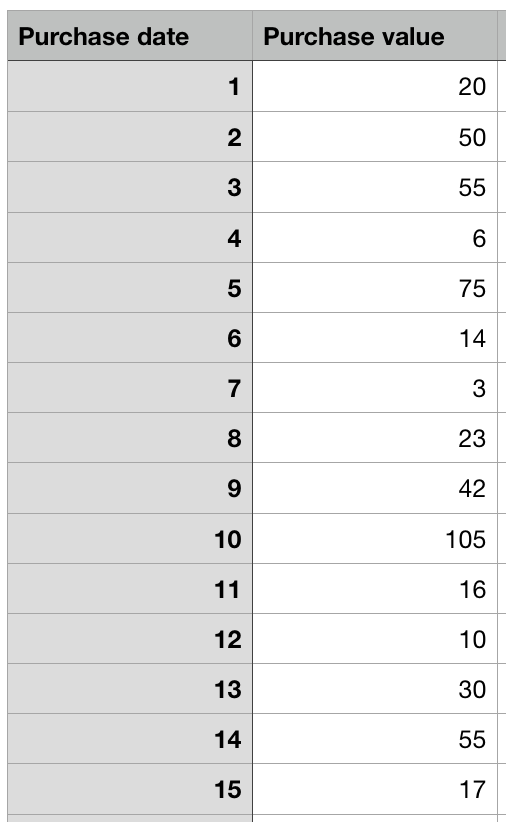
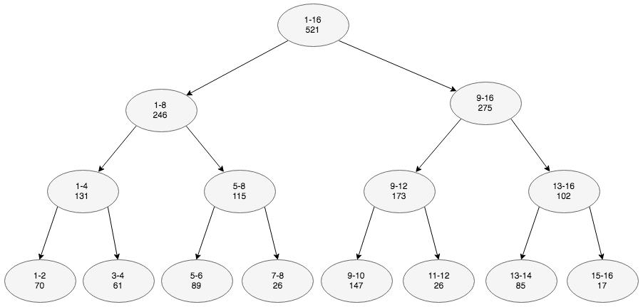

# Dyadic range

A method for answering range aggregate queries fast

## Data

Consider following purchases by a customer:

</img>

## Range tree

We build following datastructure to store pre-computed range aggregates:

</img>

> Final layer (with one key per cell) left out of illustration for simplicity

## Examples

Now range queries can be answered fast:

**SUM 5-12?**

```sql
SELECT SUM(purchase_value)
FROM purchases
WHERE purchase_date >= 5
AND purchase_date <=12
```

This query needs to only access two cells in range tree: `5-8` and `9-12`. 

Result: `115+173=288` 

**SUM 5-10?**

Get cells `5-8` and `9-10` &rarr; `115+147=262`
